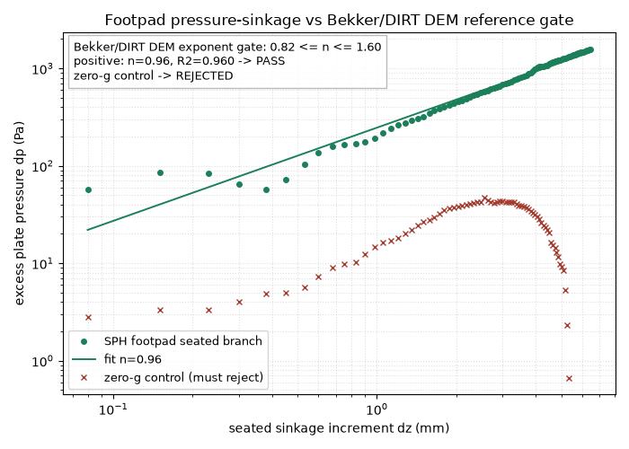

# Footpad Bearing/Sinkage

This example drives a frozen SPH plate into a granular bed and records the
vertical reaction force versus sinkage. The Rust binary still has a local
machinery check: the plate must penetrate, the bed must push upward, the force
must stay bounded, and the late reaction must exceed the early reaction.

The external validation is in `sweep.py`. It fits the seated loading branch to
the Bekker/Wong pressure-sinkage form

```text
p = (k_c / b + k_phi) z^n
```

and compares the exponent against the independent DIRT DEM plate-sinkage
benchmark in `data/dirt_bekker_reference.csv`. The gate uses the granular-soil
Bekker exponent window from the DIRT benchmark (`0.4 <= n <= 1.6`) and a tighter
band around the DIRT DEM cases with an absolute `0.25` margin. It also requires
`R^2 >= 0.90`, a rising excess pressure, and a nearly monotone seated branch.

The first 2 mm are excluded from the fit because this SPH footpad is a three
layer frozen-particle plate; those early samples are contact seating and force
offset pickup, not the Bekker loading branch. That self-consistency machinery
check remains visible in the binary output, but it is not the external oracle.

Run:

```bash
source ~/projects/.build-env
$BENCH_PYTHON examples/footpad/sweep.py
```



The plot shows the actual seated SPH pressure-sinkage branch against the
Bekker/DIRT DEM exponent gate. The zero-gravity control uses the same geometry
and material but disables gravity; it must be rejected by the same oracle.

## References

- M. G. Bekker, *Theory of Land Locomotion*, University of Michigan Press, 1956.
- M. G. Bekker, *Introduction to Terrain-Vehicle Systems*, University of Michigan
  Press, 1969.
- J. Y. Wong, *Theory of Ground Vehicles*, 4th ed., Wiley, 2008, Ch. 2.
- DIRT `examples/bench_plate_sinkage`: independent DEM plate-sinkage benchmark
  for the same Bekker pressure-sinkage form.
