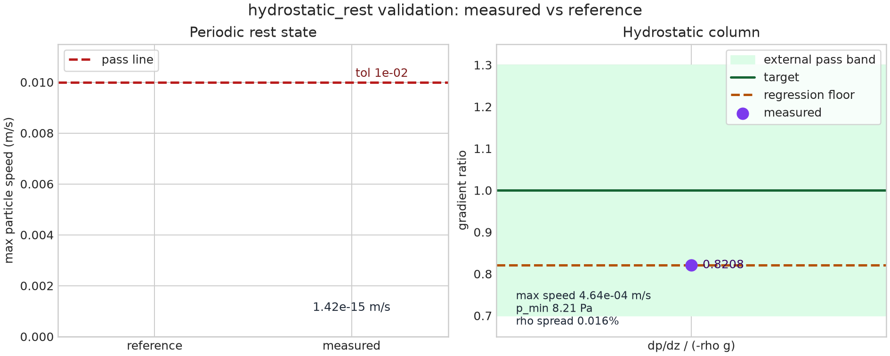

# `rest_state` - periodic rest-state check

This example runs a uniform lattice block in a fully periodic box with no
gravity. The reference state is zero motion: uniform density gives uniform
pressure, so the symmetric SPH stress-gradient force should cancel on the
lattice.

It is paired with `hydrostatic_column` as the `hydrostatic_rest` validation. The
rest-state panel checks the periodic no-gravity limit, and the hydrostatic panel
checks the Bui et al. (2008) tensile-stability case against the pressure-gradient
reference band.

## Result



Rest-state max speed is compared to the zero reference with the `1e-2 m/s` pass
line visible; the hydrostatic panel shows `dp/dz / (-rho g)` against the target,
external pass band, and regression floor. Latest regenerated result: PASS
(`max speed = 1.422e-15 m/s`, hydrostatic ratio `0.8208`).

## Run

```sh
cargo run --release --example rest_state -- examples/rest_state/config.toml
```

Regenerate the figure from the example outputs:

```sh
source ~/projects/.build-env
$BENCH_PYTHON examples/rest_state/sweep.py
```
