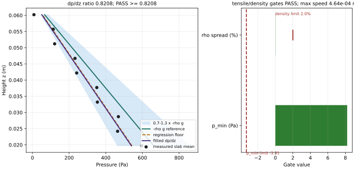
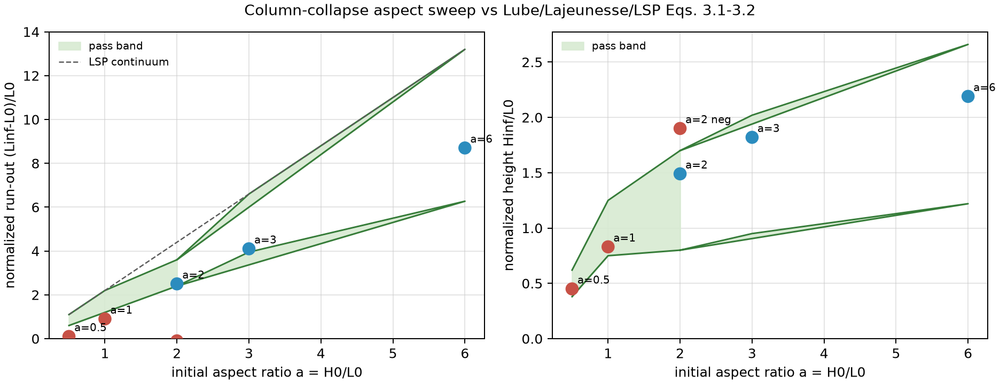

# dev_soil_sph validation set

A small, **checked-in, skeptic-facing** validation set for the dev_soil_sph granular-SPH
continuum (μ(I) dense-flow + kinetic-theory collisional branch on `soil`). Every
entry here recovers an **independent reference** — an experiment, or a different
continuum/DEM code — with a **numeric pass/fail band quoted from the cited paper**,
not back-fitted to dev_soil_sph's own output. If you are a skeptic asking *"does this SPH
code actually reproduce known granular physics, or just run without crashing?"*,
this directory is the answer.

Run the whole set:

```bash
source ~/projects/.build-env
validation/run.sh            # builds + runs only the validation examples; non-zero on any FAIL
```

`validation/manifest.toml` is the declarative source of truth for membership
(validations vs. demos) and the reference for each check.

---

## What counts as "validation" here

A **validation** must (1) compare to something dev_soil_sph did not itself produce, and
(2) fail loudly (process exit ≠ 0) when the number leaves the reference band. A
**demo** is a self-consistent operator/physics showcase — useful, but it only
checks dev_soil_sph against itself, so it is explicitly *excluded* from this set (see
"Demoted demos" below).

---

## Validation #1 — Hydrostatic column + rest state · *tensile stability*

**Examples:** `rest_state`, `hydrostatic_column`
**Reference:** Bui, Fukagawa, Sako & Ohno (2008), *IJNAMG* **32**:1537,
DOI [10.1002/nag.688](https://doi.org/10.1002/nag.688).

Bui et al. document the failure mode every SPH-soil code must survive: the
**SPH tensile instability**, which "may result in unrealistic fracture and
particles clustering ... when the material is in tension." A column of granular
material settled under gravity is a clean probe of it — the physical answer is
compressive and smooth, so any spurious tension or clumping is a numerical
artifact, not physics.

| Check | Criterion | Measured |
|---|---|---|
| Rest state (no gravity, periodic lattice) | max speed → 0 | `1.4e-15 m/s` ✓ |
| Hydrostatic gradient | `dp/dz` in `[0.7, 1.3] × (−ρg)` | ratio `0.8208` ✓ |
| Hydrostatic gradient regression | ratio `≥ 0.8208` (target `1.0`; raise as the model improves) | ratio `0.8208` ✓ |
| **No tensile instability** (Bui 2008) | `p_min ≥ −0.5% · ρgH` (compressive everywhere) | `p_min = +8.2 Pa` ✓ |
| **No clumping / voids** (Bui 2008) | density spread `(ρ_max−ρ_min)/ρ < 2%` | `0.016%` ✓ |



The committed plot is regenerated by
`$BENCH_PYTHON examples/hydrostatic_column/sweep.py`; it shows the measured
pressure profile against the `-ρg` reference, gradient pass band, regression
floor, and the tensile-instability pressure/density limits.

The pressure stays strictly positive from free surface to base and the density
field is tight to 1 part in 6000 — dev_soil_sph's kernel/EOS combination does not trip the
tensile instability on this problem, so no artificial-stress term is needed here.
(A code that *did* trip it would show negative `p_min` and a wide density spread,
and this example would exit non-zero.)

The broad `[0.7, 1.3]` hydrostatic band is the external-reference validation
window. It is intentionally not the regression guard: today the fitted pressure
gradient is still low (`dp/dz / -ρg = 0.8208`, about an 18% under-prediction), so
`hydrostatic_column` also asserts a ratchet floor of `0.8208`. That floor should
only move upward toward the physical target `1.0` as the SPH pressure-gradient
accuracy improves.

---

## Validation #2 — Simple shear μ(I) return map · *flow-law recovery*

**Example:** `simple_shear_mu_i`.
**Reference:** Jop, Forterre & Pouliquen (2006), *Nature* **441**:727,
DOI [10.1038/nature04801](https://doi.org/10.1038/nature04801), and GDR MiDi
(2004), *EPJE* **14**:341.

The example sweeps inertial number `I`, fits
`μ(I) = μ_s + (μ_2−μ_s)·I/(I+I_0)` to the measured return-map stress ratios, and
compares the fit against the cited glass-bead constants. Its committed graph is
embedded in the example README:
[`examples/simple_shear_mu_i/plots/mu_i_recovery.png`](../examples/simple_shear_mu_i/plots/mu_i_recovery.png).

| Check | Criterion | Measured |
|---|---|---|
| Fitted constants | `(μ_s, μ_2, I_0)` within 2% of `(0.380, 0.640, 0.280)` | `(0.38001, 0.63985, 0.28042)` ✓ |
| Point residuals | max `|μ_measured−μ_target| ≤ 5×10⁻³` | `1.87×10⁻⁴` ✓ |
| Fit residual | RMS `≤ 2×10⁻³` | `5.17×10⁻⁶` ✓ |
| I-collapse | same `I` at different pressure agrees within `5×10⁻³` | `1.62×10⁻³` ✓ |

---

## Validation #3 — Granular column collapse (a/b/c) · *run-out & deposit*

**Example:** `column_collapse` (configs `a`, `b`, `c` — a resolution study at
fixed aspect ratio `a = H0/L0 = 2`).
**Reference:** Lube et al. (2005) & Lajeunesse et al. (2005) experiments, as
consolidated by Lagrée, Staron & Popinet (2011), *JFM* **686**:378,
DOI [10.1017/jfm.2011.335](https://doi.org/10.1017/jfm.2011.335), Eqs. (3.1)–(3.2).

The 2-D column collapse is *the* canonical μ(I) validation. LSP Eq. (3.1) gives
the experimental planar run-out scaling

```
(L∞ − L0)/L0 ≃ λ1·a          (a < a0)          # linear regime
             ≃ λ2·a^α        (a > a0),  α ≈ 2/3           # power-law regime
```

with, from the literature they cite:

| Source | λ1 | λ2 | a0 | at **a = 2** |
|---|---|---|---|---|
| Lube et al. 2005 (sand, rice, sugar) | 1.2 | 1.9 | 1.8–2.8 | `1.2·2 = 2.40` |
| Lajeunesse et al. 2005 (glass beads) | 1.8 | 2.3 | 3.0 | `1.8·2 = 3.60` |
| LSP 2011 μ(I) *continuum* (Gerris) | 2.2 | 3.9 (α=0.7) | ≃7 | `2.2·2 = 4.40` |

So the **cited experimental envelope at a = 2 is `[2.40, 3.60]`** — that is the
pass band (`runout_lo`/`runout_hi` in `column_collapse/main.rs`), taken directly
from the two experimental fits, *not* tuned to dev_soil_sph. LSP's own μ(I) *continuum*
over-spreads to 4.40; SPH/discrete fronts under-spread that (LSP §3.1 note that
μ(I) "systematically underestimate[s] the run-out ... for large aspect ratios,"
error reaching ~10%), landing back near the experiments.

Deposit height (LSP Eq. 3.2): `H∞/L0 ≃ λ3·a (a<a0) / λ4·a^α (a>a0)`. The cited
fits at a=2 span the LSP continuum (`λ4≃0.65, α≃0.35 → 0.83`) up to the Lube
experiment branch (`λ4≃1, α≃0.4 → 1.32`); with SPH resolution scatter the pass
band is `H∞/L0 ∈ [0.8, 1.7]`.

**Measured (this model), resolution study at a = 2:**

| Config | spacing | particles | run-out `(L∞−L0)/L0` | height `H∞/L0` | result |
|---|---|---|---|---|---|
| `a` | 5.0 mm | 300  | **2.50** | 1.49 | PASS |
| `b` | 3.3 mm | 900  | **2.50** | 1.32 | PASS |
| `c` | 2.5 mm | 2400 | **2.50** | 1.32 | PASS |

Run-out is **resolution-converged** at 2.50 (identical across a 8× particle-count
range) and sits at the Lube-experiment edge of the cited envelope — i.e. dev_soil_sph
reproduces the experimental scaling and, as expected for a discrete/SPH front,
sits *below* the LSP continuum value. Deposit height converges to `1.32 = H∞/L0`,
squarely on the Lube experimental branch.

Each run also asserts the deposit **arrested** (max speed < 1 m/s) and stayed
**bounded** (granular T < 1), so "matches the scaling" cannot be reached via a
blow-up.

### Negative control — *the gate is capable of failing*

A pass band a model already sits inside proves nothing unless the band can also
**reject** a model that is wrong: an always-green check is not a validation. The
falsifiability control is `column_collapse/config_negctl.toml` — **identical**
geometry, resolution and integration to config `a`, but with an over-frictional /
cohesive material (`μ_s = 2.0, μ_2 = 2.5`; friction angle ≈ 63°–68°, far above the
~20°–40° of real sand or glass beads). Such a material has a yield stress so large
the column barely slumps, so it should *not* reproduce the Lube/Lajeunesse run-out.

The config declares `[validation] expect = "reject"`, which tells
`column_collapse/main.rs` to **invert** its verdict: the run PASSES iff the *same*
`[2.40, 3.60]` / `[0.8, 1.7]` band that configs a/b/c sit inside now **rejects**
this material, and FAILS iff the wrong physics slips through the band.

| Case | material | run-out `(L∞−L0)/L0` | height `H∞/L0` | band verdict | run result |
|---|---|---|---|---|---|
| positive (`a`) | real granular `μ_s=0.38, μ_2=0.64` | `2.50` ∈ [2.40, 3.60] | `1.49` ∈ [0.8, 1.7] | **accept** | PASS |
| **negative** (`negctl`) | over-frictional `μ_s=2.0, μ_2=2.5` | `−0.10` ✗ (< 2.40) | `1.90` ✗ (> 1.70) | **reject** | PASS (rejected) |



The committed graph is regenerated from the example-emitted deposit profiles and
shows the positive cases inside the reference bands and the negative control
outside them.

The negative control leaves the band on **both** axes (run-out under-shoots by the
full envelope, height over-shoots) — an unambiguous rejection, not a marginal one.
As a guard against the inversion being trivially green, running the *real* material
with `expect = "reject"` **fails** (`rc = 1`, "wrong physics landed INSIDE the band …
the gate is vacuous"): the control only passes because the band genuinely
discriminates real granular friction from wrong friction.

`validation/run.sh` runs this control alongside a/b/c, so the checked-in gate is
falsifiable by construction.

---

## Demoted demos (NOT part of the validation set)

These have internal PASS/FAIL smoke checks but recover **no external reference**,
so they are demonstrations, not validations. They stay in `examples/` and keep
their self-checks; they are simply excluded from `validation/` and `run.sh`.

| Example | What it demonstrates | Why not a validation |
|---|---|---|
| `haff_cooling` | granular-T decay ≈ Haff's law (KT branch) | self-consistent operator check, no external data |
| `shear_heating` | KT shear production → Bagnold `T ∝ γ̇²` | self-consistent operator check |
| `conduction_test` | SPH Laplacian for `∇·(κ∇T)` | operator unit test (analytic self-check) |
| `footpad` | driven rigid boundary + bed reaction force | machinery demo — **SPH-CFD seed** |
| `defluidization` | KT → contact stress hand-off (landing transient) | qualitative transient — **SPH-CFD seed** |

`footpad` and `defluidization` become load-bearing later for the SPH-CFD
plume-surface coupling (goal `sph-cfd-plume-surface`); they are demoted *now*
because they do not yet check against an independent oracle, not because they are
disposable.

---

## Honest caveats

- **a = 2 sits at the experimental transition** `a0`. The reference is genuinely a
  *band* (linear vs. power-law regime, plus material scatter across sand/rice/
  sugar/beads), which is why the pass window is `[2.40, 3.60]` rather than a
  single number. The band is the *published* scatter, not a loosened tolerance.
- **Only a = 2 is validated.** A full aspect-ratio sweep (a = 0.5 … ~10) against
  LSP Eqs. (3.1)–(3.2) is the natural next step; this set fixes a = 2 (the
  checked-in configs) as the first gate.
- **μ(I) under-spreads the dilute front** (LSP §3.1): expect dev_soil_sph to track the low
  (experiment) edge of the run-out band, and to need a kinetic-theory front for
  the energetic leading edge at high `a`. That is a known model limitation, not a
  bug in this validation.
